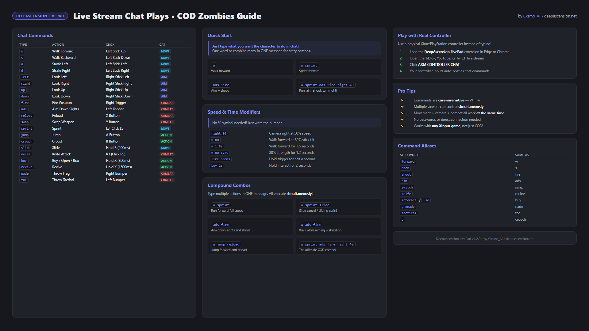
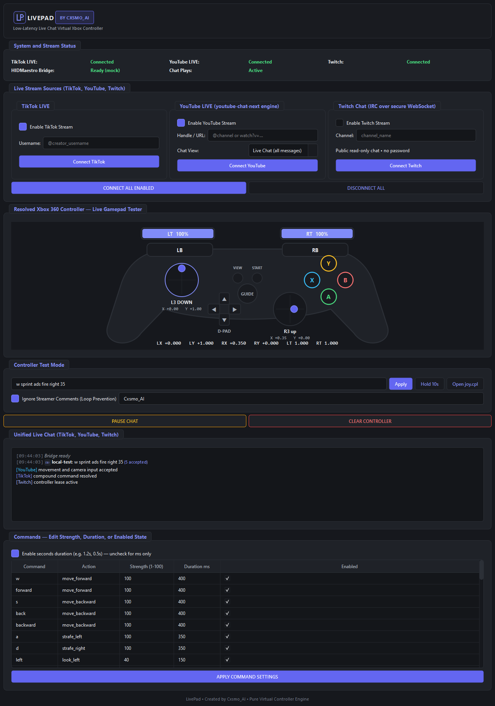

# LivePad


LivePad turns live chat into a shared Xbox-compatible controller. Viewers can
type simple commands or optionally use the separate browser extension to send
physical gamepad input through TikTok LIVE, YouTube LIVE, or Twitch chat.

The streamer app resolves all enabled chats into one low-latency controller
state and submits ordinary XInput through HIDMaestro. It does not inspect,
modify, inject into, or bypass the game.



## The LivePad workspace

The desktop app keeps stream connections, the unified chat, controller state,
and the test console in one dark, high-contrast workspace. The screenshot is a
mock-bridge capture from the same UI used by the packaged build; it does not
contain real viewer data or credentials.

[](docs/images/livepad-desktop-full-latest.png)

[Open the full-size desktop screenshot](docs/images/livepad-desktop-full-latest.png) ·
[Browse all visual assets](docs/SCREENSHOTS.md)

## Highlights

- TikTok, YouTube, and Twitch connectors with separate arm/disconnect controls.
- Unified chat with platform icons, deduplication, reconnect handling, and safe
  disconnect neutralization.
- Compound commands such as `w sprint ads fire right 35` execute concurrently.
- Per-viewer rate limits, timed leases, movement aggregation, camera pulses,
  and 1,000 Hz state scheduling.
- Optional viewer extension for controller-to-chat input; it never connects
  directly to the streamer PC.
- F12 emergency stop, bridge watchdog, neutral-on-shutdown, and no game access.
- Dark slate/indigo UI with a compact LivePad brand mark.

## Quick start for streamers

1. Download the latest `LivePad-Complete.zip` from Releases.
2. Extract it to a normal folder on Windows.
3. Run `LivePad.exe` and approve the administrator prompt required by the
   virtual controller layer.
4. Enter public channel names or URLs and arm only the platforms you want.
5. Test with `w sprint ads fire right 35`, then open your game.

The packaged app carries the Python runtime, self-contained .NET bridge, and
official HIDMaestro SDK assembly. No Python, .NET, or Visual Studio install is
required for the packaged streamer build.

## Viewer extension

The extension is intentionally separate from the streamer executable. Viewers
can load `LivePad-Extension.zip` in Edge or Chrome using Developer mode, choose
their physical controller, open a supported live chat, and arm that platform.
Every input is encoded into chat messages; there is no direct viewer-to-PC
connection. See the [easy unpacked-extension install guide](docs/EXTENSION_INSTALL.md).

## Commands

```text
w                         move forward
w sprint                  move + sprint together
ads fire                  aim + fire together
right 35                  camera pulse at 35%
w 80 1.2s sprint          80% forward for 1.2 seconds, then sprint
w sprint ads fire right 35
```

Strength is optional. Duration can be written as milliseconds (`250ms`) or,
when enabled in the GUI, seconds (`1.2s`). See the [full command guide](commands_guide.html).

## Build from source

Requirements: Windows, Python 3.10+, Node.js 20+, and .NET 10 SDK. The local
build can use the project `.dotnet` SDK; CI uses the hosted SDK setup actions.

```powershell
py -3.10 -m venv .venv
.\.venv\Scripts\python.exe -m pip install -r requirements-build.txt
.\verify.ps1
.\package.ps1
.\bundle_all.ps1
```

The production outputs are written to `release/`. `verify.ps1` runs the Python
suite, extension protocol tests, bridge mock smoke test, GUI smoke test, and
performance checks. See [docs/BUILDING.md](docs/BUILDING.md) for details.

## Safety boundary

LivePad is a normal virtual-controller application. It has no process or DLL
injection, memory reading/writing, game patching, scripts, mod menus, aimbot,
anti-cheat bypass, driver hiding, or device-spoof evasion. Read
[SAFETY.md](SAFETY.md) before using it with a game.

## Repository map

| Path | Purpose |
| --- | --- |
| `chat/` | Normalized chat events, parser, aliases, rate limiting |
| `controller/` | Timed leases, crowd resolution, safety, state scheduling |
| `controller-chat-extension/` | Separate Edge/Chrome viewer extension |
| `bridge/` | Minimal C# HIDMaestro/XInput bridge |
| `tests/` | Python unit, stress, adapter, and lifecycle coverage |
| `docs/` | Build, release, architecture, and operator documentation |
| `package.ps1` | Reproducible Windows app packaging |
| `bundle_all.ps1` | Complete ZIP and checksum assembly |

## Credits and license

LivePad is created by **Cxsmo_AI**. The project is MIT licensed; the official
HIDMaestro SDK notices are retained under `bridge/vendor/` and included in
packaged distributions.
